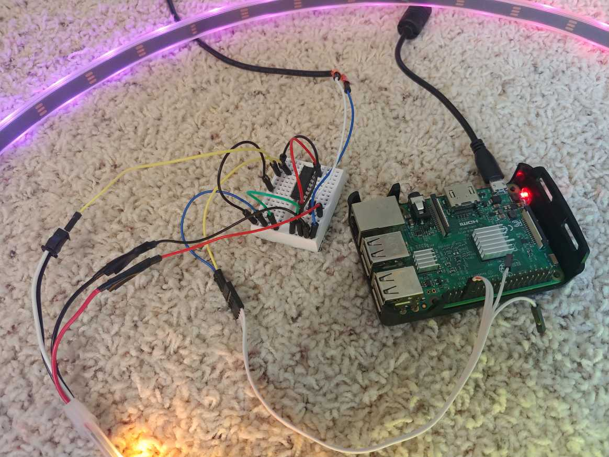
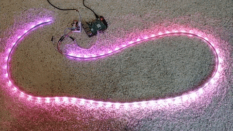

# PiLightsDigital

This code is meant to be run on a Raspberry Pi connected to the lights. The Lights directory contains main.py which listens on port 5000 for different HTTP requests. I wrote an Android phone app using Flutter to provide a straightforward user interface to control the lights and interact with the Pi.

        

#### HTTP endpoints:
- ```/off```: turns off all lights but keeps the program running
- ```/solid?r=0&g=0&b=0```: sets lights to solid (r, g, b) color
- ```/rainbow```: starts a basic rainbow loop pattern
- ```/music?...```: starts the realtime music visualizer mode. Parameters:
   - ```lv``` and ```uv```: sets the frequency boundaries for the 3 sections, in hertz (roughly).
   - ```mode```: determines how the music is visualized. ```0``` for sections shown in different rgb colors, ```1``` for sections shown in different lighted blocks, and ```2``` for a time history of the lowest, bass frequency section.
   - ```input```: sets the input method. ```socket``` for realtime streaming on port 50000 (see music_socket.py) or ```usb``` for data from a usb microphone connected to the pi.
   - ```scales[0-2]``` and ```biases[0-2]```: set the intensity and offset of the sound data for each of the 3 sections.
- ```/fade?...```: fades between 3 given colors. Parameters:
   - ```s```: how quickly the colors fade (time between increments) in seconds.
   - ```t```: how many increments or divisions there are between colors. This affects the smoothness of the fading.
   - ```centered```: ```0``` for fading across the entire strip length or ```1``` for a symmetrical pattern from the center.
   - ```a```, ```b```, ```c```: 3 colors to fade between, in the form of ```Color(0xOORRGGBB)```.
- ```/shutdown```: turns off the lights and immediately shuts down the Raspberry Pi

#### Components:
- Raspberry Pi 3B, 74AHCT125 chip, light strip, 2.1mm barrel jack connector
- Light strip: https://www.adafruit.com/product/1460?length=2
- Wiring based on this guide: https://learn.adafruit.com/neopixels-on-raspberry-pi/raspberry-pi-wiring
- **Note:** Follow [this guide](https://www.instructables.com/id/Disable-the-Built-in-Sound-Card-of-Raspberry-Pi/) to disable the Pi's soundcard because it causes the pyaudio package used in usb visualization to interfere with the neopixel PWM for the lights. Also try forcing hdmi audio instead of 3.5mm jack default.

#### TODO:
- Add bluetooth, phone microphone, or the Pi's 3.5mm jack as possible inputs for the ```music``` option
- Build a case for the Pi and a board for the light and chip wiring
- Add more modes: custom blink (metronome?), phone gyro display, phone camera mirroring, tuner
- Optimize the app's storage access to make swiping between pages more smooth


#### Demos:

[Here's a link to a music visualizer demo](/Pictures/vid_music.mp4)

    
    
